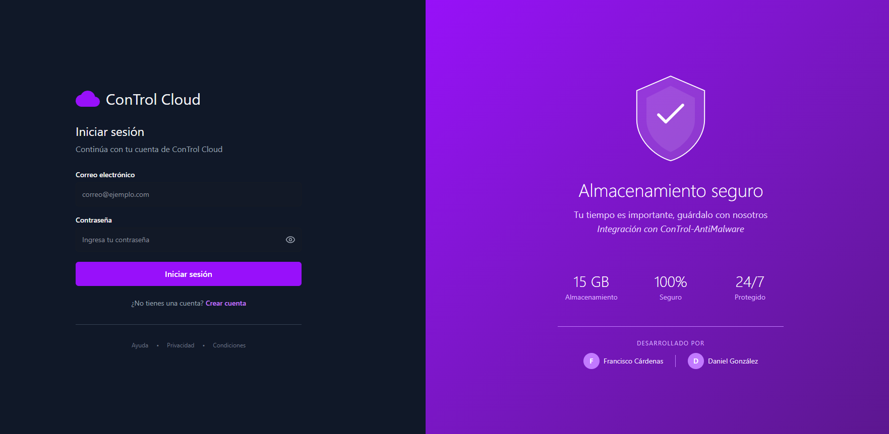
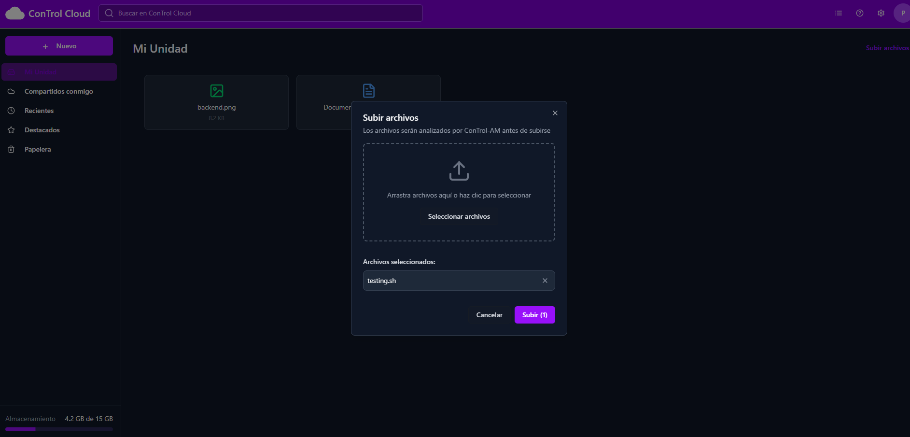
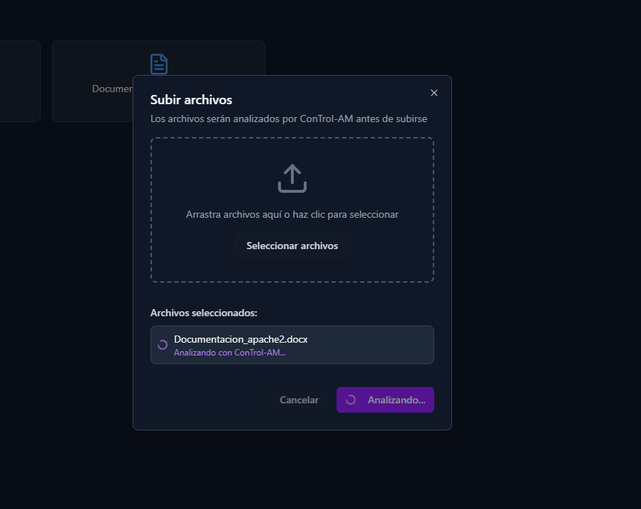
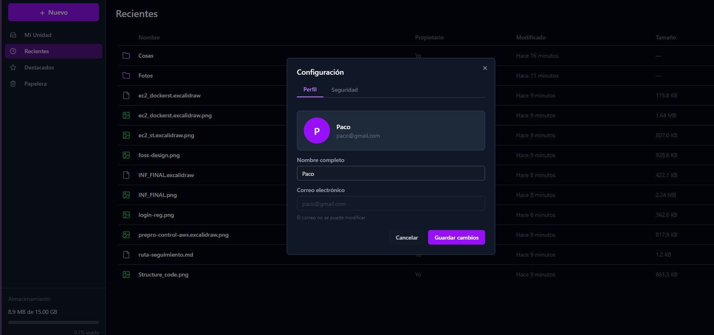
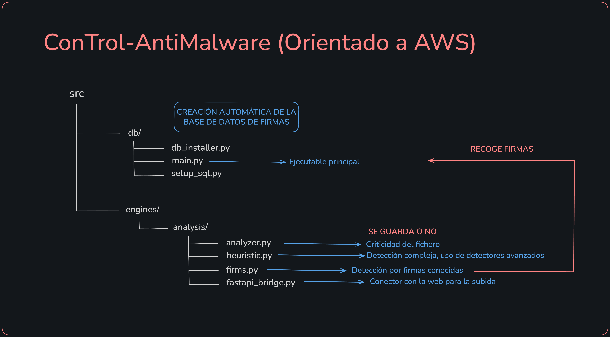
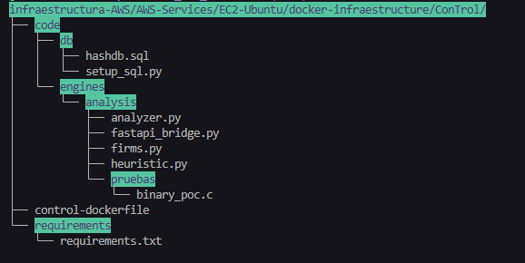
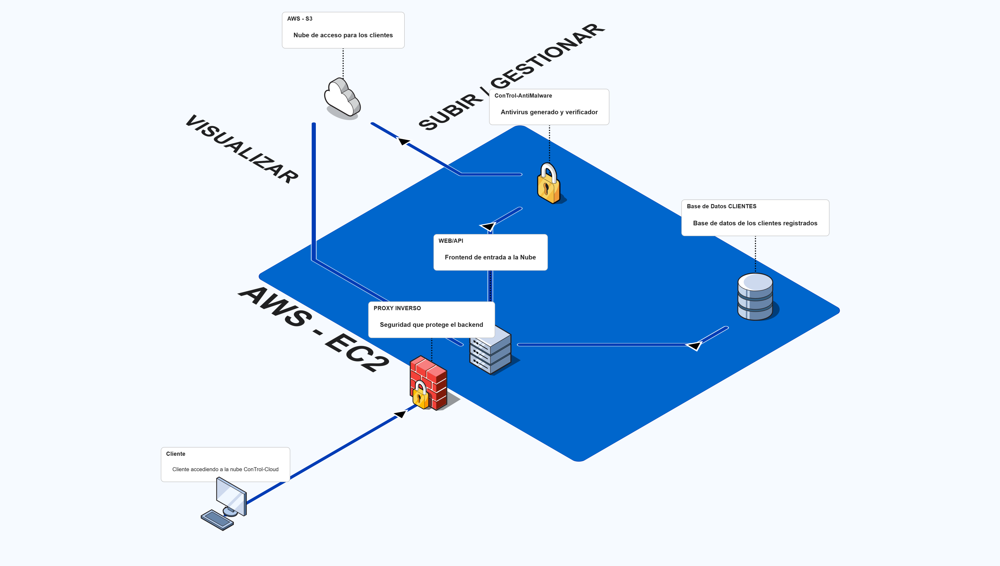

# Trabajo de final de grado (AWS + PYTHON ANTIVIRUS)

### Resumen

- Somos Daniel y Paco, realizaremos una documentación con pruebas gráficas de funcionamiento, mostrando el proceso completo de trabajo y los programas en RAW con toda su información comentada


#### Idea principal

- La idea es realizar una infraestructura en AWS (Amazon Web Service) que funcione sincronizada respetando los siguientes requisitos:

    1. infraestructura **backend**: Dentro de esta red aislada, se encuentra la comunicación interna a través de APIs construidas para funcionar en el entorno de frontend
        - La infraestructura se sostiene en un conjunto de contenedores, que se organiza en una red desmilitarizada del servidor, para evitar problemas de seguridad *(Docker Web, Docker API, Docker DB y Docker Antivirus)*
        - Existirán 2 servicios almacenados de *AWS*, que realizarán el aviso de la copia de seguridad y guardado de datos de los clientes
            - *Lambda*: Función de aviso *(Copia de seguridad)*
            - *S3*: Función de guardado y almacenaje de datos

    2. El *Antivirus* es un proyecto individual adaptado a esta infraestructura, el cual se compone de diferentes motores de ejecución para realizar distintas acciones, como analizar, monitorizar y comprobar firmas en base de datos

## Fotos del proyecto
- Página principal (Login / Register)
    

<br>

- Dashboard de control y subida de archivos:
    

<br>

- Detector AV: <br>
    

<br>

- Configuración y barra de almacenamiento:
    

<br>

## Red de Docker
- La red de docker va a consistir en 3 (O más) contenedores que serán automáticamente configurados con un script de inicialización (**auto-docker-aws.sh**) siguiendo los siguientes requisitos:
    1. Comprobador y verificador del servicio de docker, para funcionar necesita de su servicio **docker.io**
    2. Se genera 3 redes internas de docker que se intercomunicarán según se requiera de la siguiente forma:
    
    3. Generación del entorno automatizado, una sola ejecución y un archivo de configuración
    4. Uso de *proxy inverso* para la protección de la red *backend* por seguridad hacia **Internet**


### Docker Antivirus ConTrol-AntiMalware

- Proyecto individual adaptado, generado con código python utilizando el método POO *(Programación Orientada a Objetos)*, permitiendo una mejor escalabilidad y adaptabilidad a diferentes situaciones de uso y plataformas, aunque originalmente ha sido creado orientado a Linux *(En el futuro se orientará multiplataforma)* 

- Se compone de la siguiente estructura de código

    
    <br>
- El corazón del funcionamiento se divide en dos:
    - **BASE DE DATOS DE FIRMAS:** Contiene una firma conocida de hashes *(Únicamente recurrirá a esta parte si son binarios o ejecutables)*
    - **ANALYZER:** Motor que contiene la parte de análisis y comprobación del fichero a subir, dividiendo el escaneo en las siguientes fases:
        - **1º Fase** --> Comprobación rápida *(Detección del tipo de archivo y en caso de ser binario, firmas "hashdb.sql")*
        - **2º Fase** --> Comprobación de datos internos del binario *(Metadatos y heurística)*
        - **3º Fase (Final)** --> Conclusión y respuesta para la subida

> Estas 3 fases deben ejecutarse en menos de 30 segundos (OPTIMIZACIÓN MÁXIMA)
    <br>

#### Modelo técnico funcionando
- Agregar a la red *WEB-CONTROL(backend)* para aislar
- Generación de dockerfile que ejecuta *mysql* para la detección de firmas y ejecución de requerimientos
- Uso de herramientas
    - **Uvicorn**: Genera el endpoint de subida para analizar
    - **Librería FastAPI**: Permite tener como punto de subida la API REST
    - **Código CONTROL**: Analiza binario y devuelve respuesta en JSON

- Contiene una generación de la base de datos e inserción de firmas mediante *setup_sql.py*
- Estructura del contenedor
    

### Docker API

- Contenedor que sostiene todas las acciones con el backend y el *S3* para poder mostrar y gestionar todo desde el **frontend** *(REACT)*
- Es parte del backend y está completamente en TypeScript *(Variación de JavaScript)*
    

<br>

- Lista de *funciones API* que constituyen el backend:

| Método | Ruta | Descripción | Body / Params | Respuesta OK |
|--------|------|-------------|---------------|--------------|
| GET | `/api/health` | Estado del servidor | — | `{"status":"ok","timestamp":"..."}` |
| POST | `/api/auth/register` | Registro de usuario | `{"email","password","fullName"}` | `201 {"message","token","user"}` |
| POST | `/api/auth/login` | Login + JWT | `{"email","password"}` | `200 {"message","token","user"}` |
| GET | `/api/auth/verify` | Verificar token activo | — | `200 {"valid":true,"user"}` |
| POST | `/api/auth/logout` | Cerrar sesión | — | `200 {"message":"Logout exitoso"}` |
| GET | `/api/files` | Listar archivos y carpetas | `?folderId` `?starred=true` `?search=` | `200 {"files":[...]}` |
| POST | `/api/files/folder` | Crear carpeta | `{"folderName","parentFolderId?"}` | `201 {"message","folder"}` |
| GET | `/api/files/view/:fileId` | URL prefirmada S3 para visualizar | `:fileId` | `200 {"url","fileName","mimeType"}` |
| GET | `/api/files/download/:fileId` | URL prefirmada S3 para descargar | `:fileId` | `200 {"url","fileName","mimeType"}` |
| PATCH | `/api/files/star/:fileId` | Marcar/desmarcar destacado | `{"starred":true/false}` | `200 {"message"}` |
| DELETE | `/api/files/:fileId` | Eliminar archivo (borra en S3 y DB) | `:fileId` | `200 {"message"}` |
| GET | `/api/files/storage/stats` | Estadísticas de almacenamiento | — | `200 {"storageQuota","storageUsed","storageAvailable","percentageUsed"}` |
| POST | `/api/upload` | Subir archivo (escanea con ConTrol → S3) | `multipart/form-data file=` `folderId?` | `201 {"message","file":{"id","name","size","type","s3Key","antivirusStatus"}}` |

<br>

### Docker Web

- Contenedor sostenido por los siguientes puntos:
    - Aplicación *Nginx*: Es la parte que ejecuta de forma organizada lo que llega a ser visible para el *cliente* escrita y desarrollada en *REACT* (SIN DESARROLLAR DE MOMENTO)

    - Pertenece a la red *WEB-INTERNET(FRONTEND)*

### Docker MariaDB
- Contiene el contenedor donde quedará registrada la información de  los clientes, permitiendo dar acceso a la nube personal de cada cliente

- Contiene un *entrypoint* que ejecuta el entorno desde un **start.sh**, gracias al template **init.sql**

- Se guarda en un volumen local de docker llamado *db-data/*

#### Modelo técnico funcionando
- Agregar a la red *WEB-DB(backend)* para aislamiento
- Generación de base de datos con fichero **.env** configurable
- Creación de un *dockerfile + docker-compose.yml* que automatiza instalación y configuración de entorno de clientes
- Generación de la configuración con un **lanzador de entrypoint** (*start.sh*), dando entrada a la configuración básica copiando el **fichero de configuración esencial** (*.env*)

> El fichero *.env* va impuesto directamente en la raíz del entorno

> Para ejecutar entorno manualmente --> ``` docker-compose up -d --build```
## Infraestructura AWS (Resumen técnico y especificaciones de entorno)
- Vista **gráfica** de nuestra idea


    <br>
    <br>


- **Especificaciones EC2**

    | Categoría | Especificación |
    |------------|----------------|
    | **Sistema Operativo** | Ubuntu Server 24.04 LTS (o 22.04 LTS) |
    | **Arquitectura** | x86_64 |
    | **Tipo de Instancia** | t3.medium *(consume poco)*  |
    | **vCPU** | 2 núcleos virtuales |
    | **Memoria RAM** | 4 GB (según instancia) |
    | **Almacenamiento (EBS)** | 16 GB SSD gp3 *(volumen extra)* |
    | **Red** | 1 dirección IPv4 pública / 1 privada |
    | **Puerto SSH** | 22 *(abierto en Security Group) GESTIÓN*  |
    | **Puerto HTTP** | 80 *(abierto en Security Group) REDIRECCIÓN PROXY* |
    | **Puerto HTTP** | 443 *(abierto en Security Group) REDIRECCIÓN PROXY* |
    | **Usuario por defecto** | `ubuntu` |
    | **S3 Integration** | Mediante SDK (boto3) |
    | **Lambda Integration** | Copia de seguridad de datos de *clientes* |

### Lógica y diseño técnico de EC2

- El servidor contiene una red DMZ que separa el funcionamiento de la infraestructura con el entorno de nube para funcionar correctamente

- El *EC2* contiene el servicio docker para funcionar correctamente mediante la siguiente estructura:
    - Servicio de **docker**: Contiene tres contenedores que se dedican a una parte del corazón de la infraestructura:
        - Contenedor **Nginx**: Su función es servir como *proxy inverso*, obligando la conexión a que sea segura a la hora de acceder a la infraestructura

        - Contenedor **Web**: donde se ejecuta a través de un *Inverse Proxy* hacia el contenedor web *(Cifrado SSL/TLS autofirmado para PoC)*, haciendo que el mismo pueda sostener el propio contenedor *React*.

        - Contenedor **API**: Construye la gestión del *backend* para la interacción con la web

        - Contenedor **Antivirus**: Contendrá todo el código fuente y funcionamiento del sistema de protección *ConTrol*, generado por nosotros

    - Servicio de **almacenamiento S3**: Será la base de **almacenamiento** de la infraestructura nube, contiene toda la información subida por los clientes


## Sistema de almacenamiento S3
- Será la base de **almacenamiento** de la infraestructura nube, contiene toda la información subida por los clientes, contiene la siguiente configuración:
    - *(PARTE EN DESARROLLO E INVESTIGACIÓN)*

## Sistema de avisos por Lambda
- Se encarga de avisar al sistema *EC2* de generar una copia de seguridad de los datos de los clientes, volcada directamente desde el *S3*
    - *(PARTE EN DESARROLLO E INVESTIGACIÓN)*

## **(ULTIMA ACTUALIZACION DE README.md 16/03/2026 20:35)**